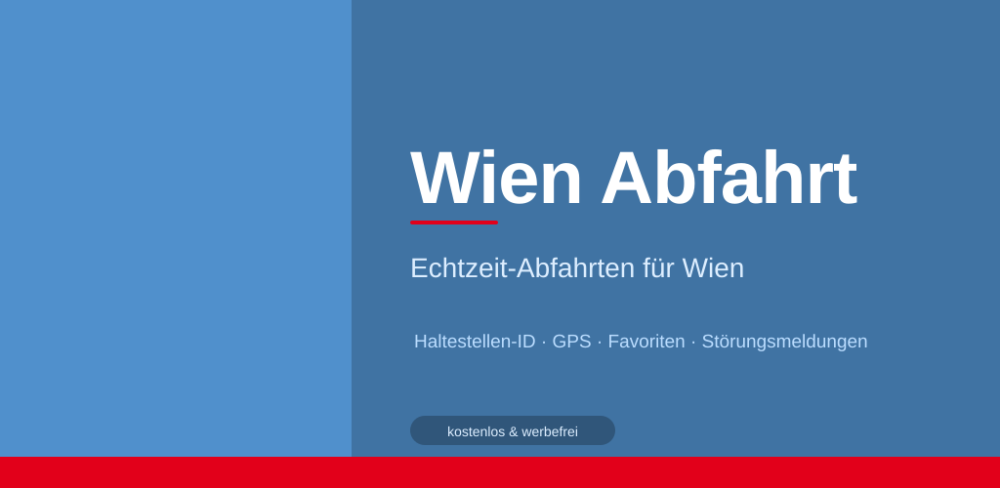

# Wien Abfahrt

Eine inoffizielle Echtzeit-Abfahrtsmonitor-App für die Wiener Linien, gebaut mit Kotlin und Jetpack Compose.

> Nutzt ausschließlich die öffentliche [OGD Echtzeit-API](https://www.wienerlinien.at/ogd_realtime/) der Wiener Linien – kein API-Key erforderlich.

---

## Features

- **Echtzeit-Abfahrten** – nächste Abfahrten für jede Haltestelle in Wien
- **GPS** – nächstgelegene Haltestelle automatisch finden
- **Suche** – nach Haltestellenname oder Stop-ID
- **Favoriten** – häufig genutzte Haltestellen speichern
- **Störungsmeldungen** – aktive Betriebsstörungen im Überblick
- **Offline-Cache** – Daten bleiben bei kurzen Netzwerkausfällen sichtbar
- **Dark Mode** – System, Hell oder Dunkel wählbar
- **Mehrsprachig** – Deutsch, Englisch, Spanisch

## Screenshots

<p float="left">
  
</p>

---

## Tech Stack

- **Sprache:** Kotlin
- **UI:** Jetpack Compose + Material 3
- **Architektur:** MVVM + Repository Pattern
- **Networking:** OkHttp
- **Serialisierung:** Gson
- **Persistence:** DataStore Preferences
- **Background:** WorkManager
- **Location:** Google Play Services (Fused Location Provider)
- **Min SDK:** 26 (Android 8.0)

---

## Projekt aufsetzen

1. Repository klonen:
   ```bash
   git clone https://github.com/DEIN-USERNAME/WienAbfahrt.git
   ```
2. In Android Studio öffnen
3. Projekt bauen und auf Gerät/Emulator starten

Kein API-Key, keine weitere Konfiguration notwendig.

---

## Architektur

```
WienerLinienApplication       ← DI-Container (Singletons)
  ├── WienerLinienApi         ← HTTP-Calls (OGD Echtzeit-API)
  ├── DepartureRepository     ← Abfahrten, Störungen, Cache, Einstellungen
  └── StopRepository          ← Haltestellensuche, GPS, CSV-Updates

DepartureViewModel            ← Shared ViewModel (Abfahrt + Favoriten + Info)
StoerungenViewModel           ← Störungen-Tab
```

Vier Tabs: **Abfahrt · Favoriten · Störungen · Info**

---

## API

Verwendet die öffentliche OGD Echtzeit-API der Wiener Linien:

| Endpoint | Zweck |
|---|---|
| `/ogd_realtime/monitor?stopId={id}` | Echtzeit-Abfahrten |
| `/ogd_realtime/trafficInfoList?categoryId=2` | Betriebsstörungen |

Rate Limit: max. 1 Request/Sekunde (wird intern eingehalten).

---

## Haltestellen-Daten

Die App enthält eine gebündelte `haltestellen_mit_linien.json` (~830 KB, ~1100 Haltestellen).  
Diese kann in den Einstellungen manuell oder wöchentlich automatisch aktualisiert werden (Quelle: OGD CSV-Dateien der Wiener Linien).

---

## Lizenz

MIT – siehe [LICENSE](LICENSE)

Diese App ist ein inoffizielles Community-Projekt und steht in keiner Verbindung zu den Wiener Linien.
